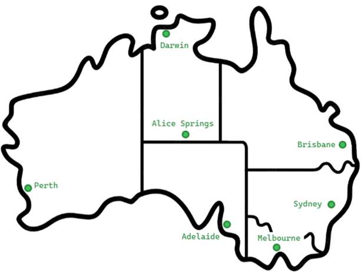

<h1 align="center">Logistics App</h1>
<h2>Project Description</h2>
Design and implement a <b>Logistics</b> console application.
  
The application will be used by employees of a large Australian company aiming to expand its activities to the freight industry. The app will be used to manage the delivery of packages between hubs in major Australian cities. An employee of the company must be able to record the details of a delivery package, create or search for suitable delivery routes, and inspect the current state of delivery packages, transport vehicles and delivery routes.

## Functional Requirements
The application **<code style="color : red">must</code>**  support the following operations:
 - Creating a **delivery package** – *unique id*, *start location*, *end location*, *weight in kg* and *contact information* for the customer.
 - Creating a delivery route – unique id and a list of locations (at least two).
    - The first location is the starting location – it has a departure time.
    - The other locations have expected arrival time.
 - Search for a route based on package’s start and end locations.
 - Updating a delivery route:
     - Аssign a free truck to it.
     - Аssign a delivery package.
 - View information about routes, packages and trucks.

\
The application **should** support the following operations:
 - Save the application state to the file system
  
## The company owns the following transport vehicles:
<table>
  <tr>
    <th style="background-color:green; color:black;"><b>Vehicle IDs</b></th>
    <th style="background-color:green; color:black;"><b>Name</b></th>
    <th style="background-color:green; color:black;"><b>Capacity (kg)</b></th>
    <th style="background-color:green; color:black;"><b>Max range (km)</b></th>
    <th style="background-color:green; color:black;"><b>Number of vehicles</b></th>
  </tr>
  <tr>
    <td>1001-1010</td>
    <td>Scania</td>
    <td>42000</td>
    <td>8000</td>
    <td>10</td>
  </tr>
  <tr>
    <td>1011-1025</td>
    <td>Man</td>
    <td>37000</td>
    <td>10000</td>
    <td>15</td>
  </tr>
  <tr>
    <td>1026-1040</td>
    <td>Actros</td>
    <td>26000</td>
    <td>13000</td>
    <td>15</td>
  </tr>
</table>

  
## Use the following distances in km:

<table>
  <tr>
    <th style="background-color:green; color:black;"><b></b></th>
    <th style="background-color:green; color:black;"><b>SYD</b></th>
    <th style="background-color:green; color:black;"><b>MEL</b></th>
    <th style="background-color:green; color:black;"><b>ADL</b></th>
    <th style="background-color:green; color:black;"><b>ASP</b></th>
    <th style="background-color:green; color:black;"><b>BRI</b></th>
    <th style="background-color:green; color:black;"><b>DAR</b></th>
    <th style="background-color:green; color:black;"><b>PER</b></th>
  </tr>
  <tr>
    <th style="background-color:green; color:black;"><b>SYD</b></th>
    <td></td><td>877</td><td>1376</td><td>2762</td><td>909</td><td>3935</td><td>4016</td>
  </tr>
  <tr>
    <th style="background-color:green; color:black;"><b>MEL</b></th>
    <td>877</td><td></td><td>725</td><td>2255</td><td>1765</td><td>3752</td><td>3509</td>
  </tr>
  <tr>
    <th style="background-color:green; color:black;"><b>ADL</b></th>
    <td>1376</td><td>725</td><td></td><td>1530</td><td>1927</td><td>3027</td><td>2785</td>
  </tr>
  <tr>
    <th style="background-color:green; color:black;"><b>ASP</b></th>
    <td>2762</td><td>2255</td><td>1530</td><td></td><td>2993</td><td>1497</td><td>2481</td>
  </tr>
  <tr>
    <th style="background-color:green; color:black;"><b>BRI</b></th>
    <td>909</td><td>1765</td><td>1927</td><td>2993</td><td></td><td>3426</td><td>4311</td>
  </tr>
  <tr>
    <th style="background-color:green; color:black;"><b>DAR</b></th>
    <td>3935</td><td>3752</td><td>3027</td><td>1497</td><td>3426</td><td></td><td>4025</td>
  </tr>
  <tr>
    <th style="background-color:green; color:black;"><b>PER</b></th>
    <td>4016</td><td>3509</td><td>2785</td><td>2481</td><td>4311</td><td>4025</td><td></td>
  </tr>
</table>
  

  

  

## Use cases
### Use case #1
 - A customer visits the company office in Sydney on Oct 8th. They bring a package that needs to be delivered to Melbourne. An employee of the company records the customer’s contact info, weighs the package at 45kg and then checks for a suitable delivery route. The system reports that there are two routes:
    - *Brisbane* (Oct 10th 06:00h) → *Sydney* (Oct 10th 20:00h) → *Melbourne* (Oct 11th 18:00h)
    - *Sydney* (Oct 12th 06:00h) → *Melbourne* (Oct 12th 20:00h) → *Adelaide* (Oct 13th 15:00h)
- Both routes' trucks have free capacity, and the employee suggests the first one, as the package will arrive one day earlier. The customer agrees and the employee uses the system to add the delivery package to the first route and to update the package’s expected arrival time to Oct 11th 18:00h.

### Use case #2
- Many packages with total weight of 23000kg have gathered in the hub in Alice Springs and an employee of the company uses the system to create a route that leaves on Sep 12th 06:00h with the following stops:
    - *Alice Springs* → *Adelaide* → *Melbourne* → *Sydney* → *Brisbane*
 - The system determines the route distance to 4041km and calculates estimated arrival times for each of the locations based on a predefined average speed of 87km/h. The employee then finds a free truck that meets the required range and capacity and proceeds to bulk assign the packages to the newly created route by using the route id and the packages’ ids.

### Use case #3
- A manager at the company uses the system to find information about all delivery routes in progress. The system responds with information that contains each route’s stops, delivery weight, and the expected current stop based on the time of the day.

### Use case #4
- A supervising employee uses the system to view information about each package that is not yet assigned to a delivery route. The system responds with a list of packages containing their IDs and locations.

### Use case #5
- A customer contacts the office to request information about their package. The customer provides the id that they received when the package was created, and an employee enters the package id in the system. It responds with detailed information which is then emailed to the customer.
  
## Technical Requirements
 - Follow the **OOP** programming principles:
    - *Encapsulate* your objects.
    - Apply *information hiding* where necessary.
    - Decide between *inheritance* and *composition* properly.
    - Use *polymorphism* properly.
- Follow guidelines for writing <a href=https://blog.pragmaticengineer.com/readable-code/> readable code</a>:
    - Adequate naming of variables, functions, classes, methods, and attributes.
    - Well-formatted and consistent code.
    - Well-structured and readable logic.
- Implement proper user input **validation** and display meaningful user messages.
- Implement proper **error handling**.
- Prefer using **list comprehensions** where readability will be improved.
- **Cover the core functionality with unit tests.**
- Use **Git** to keep your source code and for team collaboration.
  
## Teamwork Guidelines
Please see the Teamwork Guidelines document.